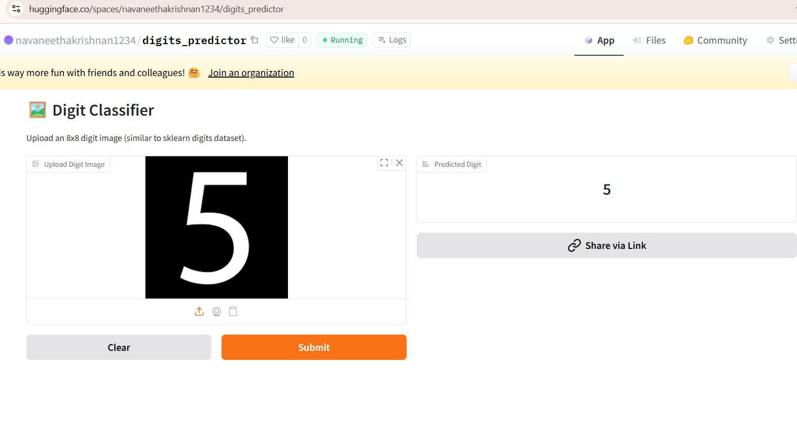

# 🔢 Digit Predictor

A simple yet powerful **Machine Learning web app** that predicts handwritten digits using a trained Decision Tree model.  
This project demonstrates the full ML pipeline – from data preprocessing to model training, saving as `.pkl`, and deploying via Gradio on Hugging Face Spaces.

🌐 **Live App**: [Digit Predictor on Hugging Face 🚀](https://huggingface.co/spaces/navaneethakrishnan1234/digits_predictor)

---

## 📌 Overview
The **Digit Predictor** takes an input digit image and classifies it into one of **0–9**.  
It is built using:
- **Python**
- **Scikit-learn**
- **Joblib**
- **Gradio**
- **Hugging Face Spaces**

---

## ✨ Features
- ✅ Upload your own digit image or draw directly in the app  
- ✅ Predict digits in real-time  
- ✅ Lightweight, fast, and easy to use  
- ✅ Deployable anywhere with Hugging Face Spaces  

---

## 🖥️ Demo
👉 Try it live here: [Digit Predictor App](https://huggingface.co/spaces/navaneethakrishnan1234/digits_predictor)

---

## 📷 Output
Below is a preview of the app in action:

  
*(Replace `output_app_image.png` with the actual screenshot from your app folder)*

---

## ⚙️ Installation (Run Locally)
Clone the repository and install dependencies:

git clone https://github.com/your-username/digit-predictor.git
cd digit-predictor
pip install -r requirements.txt

Run the app:
python app.py

📊 Model Training

Dataset: Scikit-learn Digits Dataset

Preprocessing: Feature selection & reshaping

Algorithm: Decision Tree Classifier

Model saved using joblib

🚀 Deployment

This app is deployed on Hugging Face Spaces with Gradio as the frontend framework.

🤝 Contributing

Pull requests are welcome! If you’d like to improve the model or UI, feel free to fork and submit